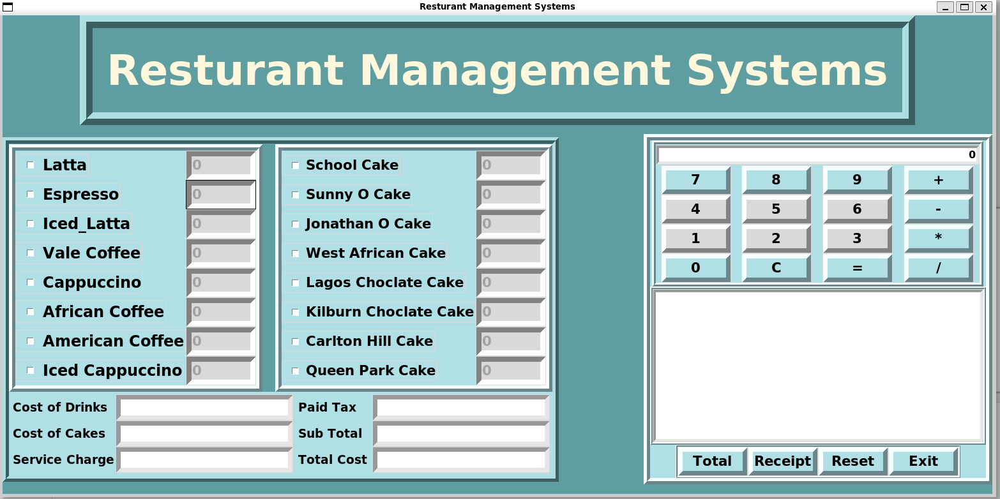

# Resturant_project
Hello, This repository contains Restaurant Management System Project. GUI-based project in Python using module Tkinter

# General
Welcome to the Restaurant Management System project repository. This system provides a convenient interface for customers to view the menu, select items, customize orders, calculate the total payment including tax, and generate receipts. Additionally, it includes a calculator feature for verifying calculations. There are the files related to the project
- system.py
# Features
- View menu items
- Select items for order
- Customize order quantities
- Calculate total payment including tax
- Generate receipts with reference number, date, and time
- Calculator for verifying calculations

The Graphical User Interface in this project [Restaurant Management System GUI](https://github.com/TasniaSanta/Resturant_project/blob/main/Gui_screenshort.png)
<!--[]-->
<!--[]-->

<!---->

The Graphical User Interface with the features in this project [System GUI](https://github.com/TasniaSanta/Resturant_project/blob/main/Gui_screenshort_total.png)

# 1. Git
Throughout the journey of building this project, I delved into the world of Git, a powerful tool for managing project versions. Before this project, I was pretty green when it came to Git. But as I dove in, pushed code, pulled changes, and merged branches, I found myself gaining confidence with each commit. Git became my trusty companion, helping me organize my work, collaborate effectively with teammates, and navigate through the twists and turns of development. Moreover, Integrating SonarCloud and GitHub Actions into our workflow has been a game-changer. It's like having a personal assistant to track our project's progress.
GitHub: 
<!---->

# 2. UML
For my project, I have used these 3 UML diagrams :
1. [SequenceDiagram](https://github.com/TasniaSanta/Resturant_project/blob/main/UMLDiagram/SequenceDiagram.png)- These diagrams offer a clear representation of the flow of operations and communication between different modules, helping to illustrate the behavior and logic of the system.
2. [UseCaseDiagram](https://github.com/TasniaSanta/Resturant_project/blob/main/UMLDiagram/UseCaseRMDiagram.png)-The diagram defining the various interactions between actors (users or external systems) and the system itself. These diagrams provide a high-level overview of the system's functionalities and the different roles involved in interacting with the system.
3. [ClassDiagram](https://github.com/TasniaSanta/Resturant_project/blob/main/UMLDiagram/classDiagramupdate.png)- The diagram has played a role in showing the static structure of our system. it illustrates the different classes, their attributes, methods, and the relationships between them.
   
# 3. DDD
In my project, I've chosen Domain-Driven Design (DDD) for its focus on modeling the core domain, establishing clear boundaries, and promoting collaboration through a ubiquitous language.
1. I conducted a collaborative brainstorming session to outline project goals and features. Through various techniques like mind mapping, I generated ideas and prioritized requirements, setting the foundation for the development plan.[Brainstorming](https://github.com/TasniaSanta/Resturant_project/blob/main/DDD/BrainstormingFirststep.png)
2. I recorded the key domain concepts, aiming for a deep understanding. This helped me to make a better decision.[Domain_concepts](https://github.com/TasniaSanta/Resturant_project/blob/main/DDD/domainidea.png)
3. After grasping domain ideas, I honed in on developing a 'ubiquitous language'—a common vocabulary that I could easily understand to ensure smooth communication.[ubiquitous language](https://github.com/TasniaSanta/Resturant_project/blob/main/DDD/domainUbiquitous%20Language.png)
4. After gathering ideas, I sketched out a context map a visual roadmap outlining key content and its relationships.[ContexMapping](https://github.com/TasniaSanta/Resturant_project/blob/main/DDD/ContexMapping.png)
5. And finally Core domain chart.[CoreDomainChart](https://github.com/TasniaSanta/Resturant_project/blob/main/DDD/CoreDomainChart.png)

# 4. Metrics
I have used the sonar cloud to maintain and analyze code quality

